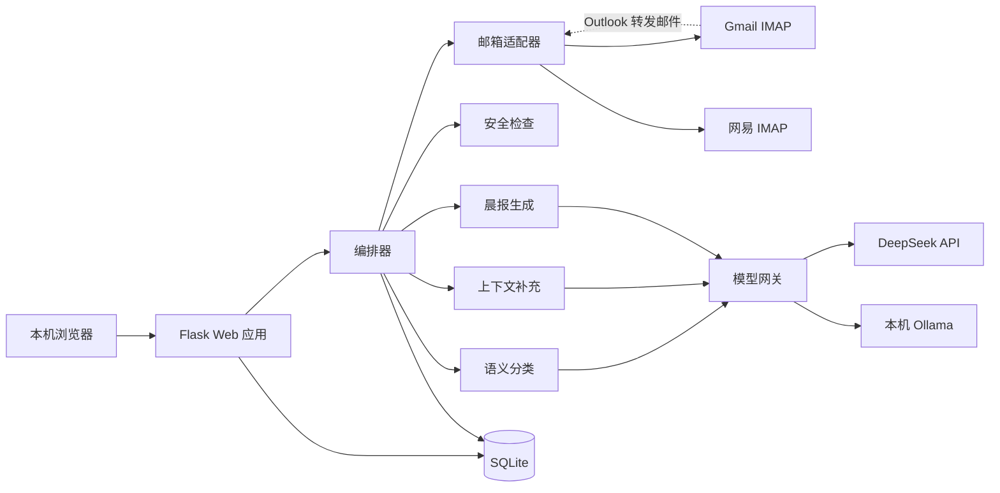
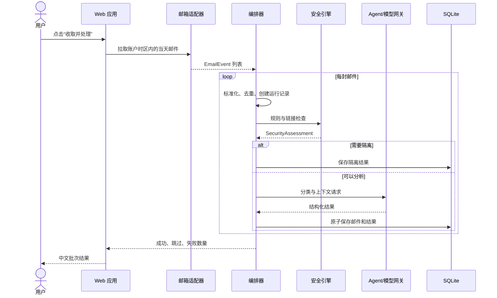

# 邮件 Agent 架构基线

## 架构目标

项目采用模块化单体架构：一个本地 Flask 进程提供 Web 页面和应用服务，SQLite 保存配置与处理结果，邮件适配器连接外部邮箱，模型网关连接 DeepSeek 或 Ollama。模块通过明确的数据契约协作，后续可把耗时处理拆成后台任务，而无需改写业务语义。

架构必须满足当天邮件增量处理、单封故障隔离、来源可追溯、分类可纠正、模型可切换和隐私模式可解释。

## 系统边界

信任边界位于浏览器与 Flask、应用与邮箱服务、应用与 DeepSeek、应用与 Ollama、应用与外部网站、应用与本地存储之间。

## 逻辑模块

| 模块 | 责任 | 输入 | 输出 |
|---|---|---|---|
| 账户与密钥 | 管理邮箱账户、模型选择和密钥引用 | 用户配置 | `MailAccount`、模型配置 |
| 邮箱适配器 | 鉴权、检索当天邮件、标准化原始邮件、生成原文链接 | 账户、时间范围 | `EmailEvent` |
| 批次编排器 | 去重、状态迁移、逐封隔离、重试和记录处理运行 | `EmailEvent[]` | `ProcessingRun[]` |
| 安全引擎 | 规则扫描、链接与身份风险分析、模型辅助判断 | `NormalizedEmail` | `SecurityAssessment` |
| 分类 Agent | 识别细分类、优先级、人工关注和摘要 | 邮件、安全结果 | `TriageResult` |
| 上下文 Agent | 查询本地联系人、可选网站信息与知识引用 | 邮件、分类 | `ContextBundle` |
| 晨报 Agent | 聚合当天结果并生成结构化中文晨报 | 当天邮件、待办 | `DigestReport` |
| 反馈与评估 | 保存人工纠正，形成离线评估数据 | 用户修改 | `CorrectionRecord` |
| 展示层 | 中文页面、筛选、错误反馈、原文跳转 | 查询模型 | HTML/JSON |

## Agent 与确定性工具边界

Agent 只负责需要语言理解、模糊推断或自然语言生成的任务。所有安全关键、状态关键和可精确计算的步骤由确定性代码负责。

| 能力 | 执行者 | 原因 |
|---|---|---|
| IMAP 鉴权、当天范围、分页与重试 | 确定性工具 | 协议行为必须可复现 |
| MIME/HTML/转发邮件解析 | 确定性工具 | 避免模型遗漏正文和链接 |
| Message-ID 去重、幂等键、状态机 | 确定性工具 | 防止重复处理和状态漂移 |
| Gmail/网易原文 URL 生成 | 确定性工具 | 由 provider ID 与规则生成 |
| 域名、URL、附件和规则型风险检查 | 确定性工具 | 结果可审计 |
| 冒充、诱导和上下文风险补充 | 安全 Agent | 需要语义理解 |
| 细粒度分类、摘要、优先级建议 | 分类 Agent | 需要理解正文语义 |
| 联系人查询 | 确定性工具 | 数据库查询必须准确 |
| 网站/知识检索 | 受限工具 | 必须经过 SSRF 与隐私策略检查 |
| 检索结果归纳 | 上下文 Agent | 需要语言压缩与相关性判断 |
| 晨报统计和分组 | 确定性工具 | 数量必须准确 |
| 晨报叙述 | 晨报 Agent | 需要自然语言表达 |
| 发送、删除、归档邮件 | 用户动作 | v1 不允许 Agent 执行 |

### 模型输出约束

- Agent 输出必须通过 JSON Schema 校验。
- 无效枚举、缺失字段和解析失败进入降级路径，不直接写成成功结果。
- 安全规则是下限：模型不能降低已命中的高风险规则等级。
- 分类结果保留 `confidence`、`reason_codes` 和模型版本。
- 晨报中的计数、时间和链接由代码注入，模型只生成描述文字。

## 标准处理流程

## 状态机与失败策略

状态为 `RECEIVED → NORMALIZED → SECURITY_CHECKED → CLASSIFIED → ENRICHED → COMPLETED`；旁路状态包括 `QUARANTINED`、`FAILED_RETRYABLE`、`FAILED_FINAL`、`SKIPPED_DUPLICATE`。

- 单封失败只更新该邮件运行记录，批次继续。
- IMAP 认证失败在批次前终止，并显示针对 Gmail/网易的授权码指引。
- DeepSeek 不可用时可按用户配置切换 Ollama，不能静默改变隐私模式。
- 上下文失败时保留分类结果，并标记上下文不完整。
- 晨报失败时仍显示确定性统计和分组。
- 可重试步骤使用有限次数、指数退避和错误类型白名单。

## 运行形态与演进边界

- v1 使用单机 Flask、SQLite、同步触发和逐封隔离。
- Gmail/网易使用 IMAP SSL 与邮箱授权码。
- DeepSeek 与 Ollama 由统一模型网关适配。
- 邮箱适配器遵守统一接口，未来加入 Gmail API、Microsoft Graph 时不改业务 Agent。
- 模型网关屏蔽供应商请求格式，提示词与模型配置分离。
- 数据访问集中在 repository 层；编排器不依赖 Flask request。

## 接口与版本规则

- `/schemas/email_agent_contracts.schema.json` 是领域对象结构基线。
- 所有时间使用带时区 RFC 3339；“当天”按账户时区计算。
- `message_id` 使用邮件 Message-ID；缺失时生成稳定指纹。
- `source_id` 保存邮箱服务 UID/provider ID，用于原文跳转。
- 存储层使用稳定英文枚举，中文 UI 负责映射。
- 破坏性 Schema 变更必须配套数据库迁移和回滚说明。

## 已确认决策

| 决策 | 选择 | 理由 |
|---|---|---|
| 产品形态 | 独立本地 Web 应用 | 用户拥有代码、数据和运行环境 |
| 工作流实现 | 自研编排，借鉴 n8n | 保留节点化思路，不依赖 n8n 运行时 |
| v1 存储 | SQLite | 单用户部署简单，可迁移 |
| v1 邮件协议 | Gmail/网易 IMAP | Outlook 暂用转发 |
| 模型 | DeepSeek 优先，Ollama 备选 | 支持个人 API 和本地隐私模式 |
| 自动外部动作 | 禁止 | v1 只读与分析 |
| 晨报交付 | 应用内生成 | 用户已取消 Telegram 推送 |

