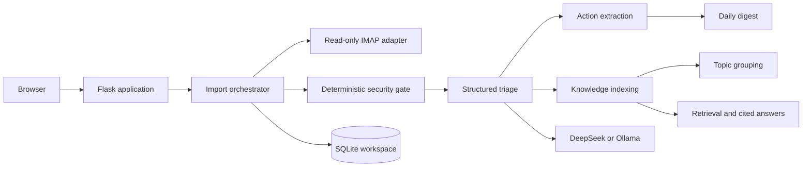
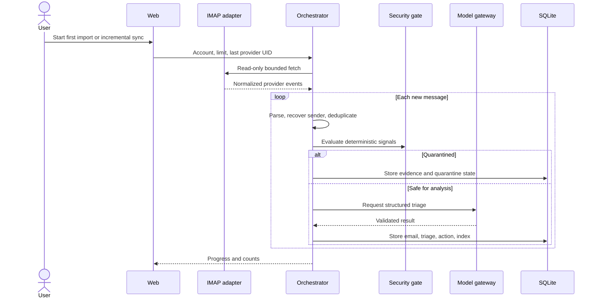

# TraceInbox Architecture

## Overview

TraceInbox uses a modular Flask monolith. Flask serves the bilingual interface and application routes; SQLite stores accounts, messages, derived results, synchronization state, knowledge chunks, actions, and audit data; mailbox adapters communicate with IMAP providers; and a model gateway supports DeepSeek or Ollama. The public demo follows the same UI flow but replaces external services with a reproducible synthetic dataset.

## Main modules

| Module | Responsibility |
|---|---|
| `app/main.py` | Routes, authentication gates, onboarding, bilingual UI orchestration |
| `app/email_client.py` | Read-only IMAP access, bounded import, provider UID synchronization |
| `app/forwarded_mail.py` | Forwarded-message parsing and original-sender recovery |
| `app/security.py` | Deterministic threat signals and quarantine decisions |
| `app/triage.py` | Structured semantic classification, summaries, priority, and deadlines |
| `app/actions.py` | Idempotent action-item creation and state changes |
| `app/knowledge.py` | Stable document/chunk indexing with content hashes |
| `app/topics.py` | Deterministic cross-email topic keys and presentation labels |
| `app/rag.py` | Local retrieval, bounded model context, answer generation, citations |
| `app/digest.py` | Daily aggregation and readable briefing generation |
| `app/auth.py`, `tenant.py` | Login and per-user workspace isolation |
| `app/settings_store.py` | Account settings and encrypted credential storage |
| `app/demo_seed.py`, `demo_answers.py` | Safe 20-message public dataset and reproducible answers |
| `app/migrations.py` | Versioned SQLite schema evolution |

## Deterministic and model boundaries

TraceInbox does not assign every step to a model.

| Capability | Executor | Reason |
|---|---|---|
| Authentication, dates, pagination, retries | Deterministic code | Protocol behavior must be reproducible |
| MIME and forwarded-mail parsing | Deterministic code | Complete content and identity handling |
| UID/message deduplication and state | Deterministic code | Prevent duplicate work and state drift |
| Source-link construction | Deterministic code | Links must use trusted provider identifiers |
| Rule-based security checks | Deterministic code | Auditable minimum safety boundary |
| Semantic risk, intent, summary, priority | Model with validation | Requires language understanding |
| Topic identifiers and retrieval ranking | Deterministic code | Stable grouping and inspectable evidence |
| Answer wording and digest narration | Model or reproducible demo path | Natural-language synthesis |
| Sending, deleting, archiving mail | User only | Outside the read-only v1 scope |

Model output is normalized before persistence. Deterministic security findings cannot be lowered by the model. Counts, timestamps, states, and source links are calculated by code rather than generated.

## Import flow

## Data and state

Provider UIDs and message identities provide stable incremental synchronization. Knowledge documents and chunks use content hashes so re-indexing is idempotent. Action generation is also idempotent. The core data contracts are documented in [`docs/DATA_CONTRACTS.md`](docs/DATA_CONTRACTS.md) and represented in [`schemas/email_agent_contracts.schema.json`](schemas/email_agent_contracts.schema.json).

Typical processing states progress from received and normalized through security checked, classified, indexed, and completed. Quarantined, retryable failure, final failure, and duplicate-skip are explicit alternate outcomes. A single-message error does not cancel the remaining batch.

## Deployment boundaries

- **Public demo:** synthetic data, no mailbox/API credentials, no external model, read-only/simulated mutations.
- **Personal local:** SQLite and credentials remain on the user's computer; DeepSeek or Ollama can be selected.
- **Hosted multi-user prototype:** authentication, account-bound workspaces, hashed passwords, and encrypted user credentials. Durable managed storage and a production security review are still required.

The Flask process is intentionally simple for course reproduction. Expensive import and model tasks can later move to a queue without changing the domain contracts.

## Failure behavior

- Mailbox authentication fails before the batch and returns provider-specific guidance.
- Individual parsing or model errors are recorded against that message while the batch continues.
- Context or model failure preserves deterministic security and import results.
- Invalid model output is normalized or rejected instead of silently becoming a successful classification.
- The public demo has no dependency on mailbox, DeepSeek, or Ollama availability.

## Architectural trade-offs

SQLite and a modular monolith maximize local ownership and reproducibility but are not the final architecture for a durable public service. Lexical retrieval is transparent and effective for exact course/project identifiers, but hybrid vector retrieval would improve paraphrase recall. IMAP app passwords reduced integration time, while OAuth would provide stronger onboarding and revocation. These trade-offs are evaluated in the final report rather than hidden.
