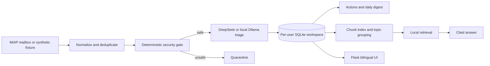

# TraceInbox

[Live course demo](https://email-agent-workflow.onrender.com/) · [Formatted Word report](deliverables/TraceInbox_Final_Project_Report.docx) · [Report text](FINAL_REPORT.md) · [Evaluation results](evals/results/metrics_summary.md) · [Architecture](ARCHITECTURE.md)

TraceInbox is a bilingual, privacy-aware email intelligence workspace that turns a crowded inbox into a traceable working view. It imports email, checks security risk, classifies and summarizes messages, extracts action items, groups related messages into knowledge topics, creates a daily digest, and answers cross-email questions with links to the supporting messages.

The repository contains a safe 20-email public demonstration, the local/full product implementation, synthetic data, executable evaluations, saved results, tests, deployment configuration, and the course report.

## Reviewer quick path

For the fastest review:

1. Open the [live demo](https://email-agent-workflow.onrender.com/). Its prefilled email and API fields are fictional and are never submitted to a mailbox or model.
2. Try the dashboard, email details, actions, knowledge topics, cited questions, daily digest, language switch, and simulated “open original email” flow.
3. Read the polished [≤1,200-word Word report](deliverables/TraceInbox_Final_Project_Report.docx) for the problem, business/technical trade-offs, critique, difficulties, tuning, results, and future path. A plain-text version remains in [FINAL_REPORT.md](FINAL_REPORT.md).
4. Inspect the [20 transparent synthetic emails](fixtures/demo_email_cases.json) and their [data explainer](fixtures/README.md).
5. Review the [evaluation explainer](evals/README.md), [metric summary](evals/results/metrics_summary.md), and saved [real-DeepSeek results](evals/results/model_evaluation.md).
6. Run the Docker demo and automated tests using the commands below.

## Problem and product definition

Important information is fragmented across individual emails. A user must repeatedly scan threads, reconcile updates, remember deadlines, separate optional information from real actions, and reopen Gmail to verify the source. This project tests whether a small, user-controlled agent can reduce that work without hiding evidence or taking irreversible actions.

### Persona

The primary persona is a student or knowledge worker managing course, project, subscription, security, support, career, and event email across one or more accounts. They want concise decisions and reminders, but still need to inspect the original evidence. They may prefer a cloud model for convenience or a local model for privacy.

### Inputs and outputs

| Inputs | Processing | Outputs |
| --- | --- | --- |
| Gmail or NetEase messages via read-only IMAP; forwarded Outlook messages; or the synthetic fixture | Normalization, sender recovery, deterministic security gate, model triage, action extraction, indexing, topic grouping, local retrieval and bounded generation | Prioritized email list, bilingual summaries, actions and deadlines, topic pages, cited cross-email answers, daily digest, and original-message links |

The application does **not** send, delete, archive, or automatically reply to email.

## Main capabilities

- Incremental IMAP synchronization using stable provider UIDs without changing read status
- Forwarded-message parsing and recovery of the original sender
- Deterministic quarantine checks before any model analysis
- Intent, priority, action, deadline, English summary, and Chinese summary extraction
- Idempotent action creation and status tracking
- Stable local email/chunk indexing and related-message topic organization
- Cross-email retrieval and answers with numbered, openable source citations
- Gmail navigation when an exact thread ID is available
- English-first course UI with a full Chinese language switch
- Welcome/onboarding import flow with progress, dashboard, email detail, actions, knowledge, digest, and settings
- Separate local, public-demo, and authenticated multi-user modes

## High-level architecture



Security-critical and state-critical operations—authentication, synchronization, UID deduplication, quarantine thresholds, database writes, retrieval boundaries, and links—remain deterministic. The model handles language understanding and generation. See [ARCHITECTURE.md](ARCHITECTURE.md) for module boundaries and data flow, [docs/DATA_CONTRACTS.md](docs/DATA_CONTRACTS.md) for stored structures, and [schemas/email_agent_contracts.schema.json](schemas/email_agent_contracts.schema.json) for contracts.

## Evaluation and actual results

The project deliberately separates known-set regression, held-out evaluation, live-deployment validation, and model-backed evaluation. A 100% regression score is **not** presented as production accuracy.

| Evaluation | Actual result |
| --- | --- |
| Fixed 20-email regression | 100% deterministic product checks on the known development set |
| First frozen 10-email holdout | Topic key 10%; retrieval precision 87.5%, recall 100%, exact source set 80%; unsupported-question abstention 0% |
| Known holdout after fixes | Topic key 100%; retrieval precision 100%, recall 85.7%, exact source set 80%; abstention 100%—reported only as regression, not independent evidence |
| Real DeepSeek triage on synthetic mail | Intent 89.5%; priority 73.7%; action decision 79.0%; exact deadline 73.7%; API success 100% |
| Real DeepSeek cross-email answers | Exact source sets 100%; 6/10 fully acceptable; author semantic score 79%; one material security contradiction |
| Performance | Triage median/P95 1.723/2.154 s; answer median/P95 40.894/51.896 s |
| Automated software tests | 42 passed |

Targets and reached values, including failed targets, are in [evals/results/metrics_summary.md](evals/results/metrics_summary.md). Raw model predictions and answers are preserved in [model_evaluation.json](evals/results/model_evaluation.json); the question-by-question semantic review is in [model_answer_human_review.md](evals/results/model_answer_human_review.md). The semantic review is author-scored and is not represented as an independent human study.

### Where to find evaluation evidence

| Evidence | Location |
| --- | --- |
| Evaluation design and commands | [evals/README.md](evals/README.md) |
| Human scoring rubric | [evals/HUMAN_EVAL_RUBRIC.md](evals/HUMAN_EVAL_RUBRIC.md) |
| 20 visible demo cases and gold labels | [fixtures/demo_email_cases.json](fixtures/demo_email_cases.json) |
| Frozen unseen email cases | [fixtures/holdout_email_cases.json](fixtures/holdout_email_cases.json) |
| Cross-email QA cases | [evals/demo_qa_cases.json](evals/demo_qa_cases.json) |
| Frozen unseen QA cases | [evals/holdout_qa_cases.json](evals/holdout_qa_cases.json) |
| Baseline/final deterministic comparison | [evals/results/comparison.md](evals/results/comparison.md) |
| Original untouched holdout result | [evals/results/holdout.md](evals/results/holdout.md) |
| Post-fix known-holdout regression | [evals/results/holdout_after_fix.md](evals/results/holdout_after_fix.md) |
| Live Render validation | [evals/results/live_demo_validation.md](evals/results/live_demo_validation.md) |
| Real-model metrics and failures | [evals/results/model_evaluation.md](evals/results/model_evaluation.md) |

## Run the safe demo

The simplest reproducible route uses Docker and requires no mailbox or API credentials:

```bash
git clone https://github.com/513-wys/email-agent-workflow.git
cd email-agent-workflow
docker compose up --build
```

Open <http://127.0.0.1:8000>. Docker enables `PUBLIC_DEMO=true`, seeds the 20 fictional emails, disables external mailbox/model calls, and presents a read-only product walkthrough.

Without Docker:

```bash
python3 -m venv .venv
source .venv/bin/activate
pip install -r requirements.txt
cp .env.example .env
PUBLIC_DEMO=true DEMO_MODE=true python run.py
```

## Run the personal version

```bash
python3 -m venv .venv
source .venv/bin/activate
pip install -r requirements.txt
cp .env.example .env
python run.py
```

Then open <http://127.0.0.1:8000>, select Gmail or NetEase, enter an app-specific mailbox password, choose the first-import limit, and configure either a DeepSeek API key or local Ollama. Do not use a normal mailbox password. DeepSeek mode sends the selected email content to DeepSeek; Ollama keeps model inference local.

### Use Outlook or an institutional mailbox through forwarding

TraceInbox does not currently sign in directly to Outlook, Microsoft 365, or a university/institutional mailbox. To include those messages, configure automatic forwarding from that account to the Gmail address connected to TraceInbox:

1. Open the source mailbox's web settings. In Outlook, look under **Settings → Mail → Forwarding**; institutional Microsoft 365 layouts may place the same option under **View all Outlook settings → Mail → Forwarding**.
2. Enable automatic forwarding and enter the connected Gmail address. Keep a copy in the source mailbox if that option is available and desired.
3. Complete any confirmation step required by the source or destination provider, then send one test message before starting a large import.
4. In TraceInbox onboarding, list the forwarded address under the additional addresses that belong to you. This helps distinguish your forwarding account from the true external sender.
5. Import through the connected Gmail account. TraceInbox inspects common forwarded-message headers and body markers and displays the original sender when the forwarding format is recognizable.

Forwarding availability depends on the organization. Some schools disable user-controlled forwarding or require an administrator to approve it. In that case, TraceInbox cannot currently connect to that mailbox directly. Native Outlook/Microsoft Graph OAuth remains future work.

The full variable list and safe placeholders are in [.env.example](.env.example). Important production values include `APP_SECRET_KEY`, `APP_ENCRYPTION_KEY`, and `COOKIE_SECURE=true`. Never commit `.env`, `data/`, credentials, or SQLite databases; they are ignored by Git and Docker.

## Run tests and evaluations

Install the test runner if it is not already available, then execute:

```bash
pip install pytest
PYTHONPATH=. pytest -q
```

Deterministic and held-out evaluations do not call an external model:

```bash
PYTHONPATH=. python evals/run_baseline.py
PYTHONPATH=. python evals/run_final.py
PYTHONPATH=. python evals/run_holdout.py
PYTHONPATH=. python evals/run_holdout_after_fix.py
```

The model-backed run uses only synthetic email content, but it calls the configured DeepSeek API and may incur provider usage:

```bash
PYTHONPATH=. python evals/run_model_evaluation.py
```

## Deployment modes and privacy boundary

| Mode | Mailbox and data | Model behavior | Intended use |
| --- | --- | --- | --- |
| Public course demo | 20 synthetic messages; mailbox access disabled | Checked-in reproducible answers; external model disabled | Safe assessment and product walkthrough |
| Personal local | User's local workspace; optional Gmail/NetEase IMAP | Personal DeepSeek key or local Ollama | Individual use and development |
| Hosted multi-user | Authentication plus separate workspace database per account | Each user supplies their own encrypted credentials | Prototype only; needs durable managed storage before production |

Passwords are salted and hashed. Mailbox app passwords and DeepSeek keys are encrypted at rest and never displayed back to the browser. Public-demo values are ignored rather than stored. See [SECURITY_PRIVACY.md](SECURITY_PRIVACY.md) for threat boundaries and remaining risks.

## Repository guide

| Path | Purpose |
| --- | --- |
| `app/main.py` | Flask routes, authentication gates, and bilingual UI orchestration |
| `app/email_client.py`, `forwarded_mail.py` | IMAP sync, normalization, and original-sender recovery |
| `app/security.py`, `triage.py`, `actions.py` | Safety gate, structured model analysis, and idempotent actions |
| `app/knowledge.py`, `topics.py`, `rag.py` | Indexing, topic organization, retrieval, generation, and citations |
| `app/auth.py`, `tenant.py`, `settings_store.py` | Accounts, per-user isolation, and encrypted settings |
| `app/demo_seed.py`, `demo_answers.py` | Reproducible public-demo data and answers |
| `app/templates/`, `app/static/` | Responsive English/Chinese interface |
| `fixtures/` | Synthetic development and frozen holdout email data |
| `evals/` | Evaluation datasets, runners, rubric, saved results, and explanation |
| `tests/` | Automated unit and integration regression tests |
| `Dockerfile`, `compose.yaml`, `render.yaml` | Local container and Render deployment |
| `PRODUCT.md`, `ARCHITECTURE.md`, `DESIGN.md` | Detailed product, technical, and visual-design decisions |
| `deliverables/TraceInbox_Final_Project_Report.docx`, `FINAL_REPORT.md` | Formatted submission report and plain-text repository version |

Every Python application module includes a module-level description so a human reviewer or coding agent can scan responsibilities without reading every line.

## Trade-offs and known limitations

- IMAP app passwords reduced prototype integration time, but OAuth would provide better onboarding and credential control.
- SQLite keeps local deployment simple, but Render's free filesystem is ephemeral; a real hosted service needs durable encrypted storage or a managed database.
- Lexical retrieval is inspectable and effective for exact identifiers, but is less robust than hybrid lexical/vector retrieval on paraphrases.
- The curated demo is reproducible but small and English-only. The first holdout exposed overfitting, and there is no second untouched multilingual holdout.
- The real-model run found incomplete answers, a security-alert contradiction, and slow QA latency. These failures are retained in the results rather than hidden.
- Attachments, provider OAuth, native Outlook/Microsoft Graph, cost telemetry, user corrections, and a production security audit remain future work.

The full business and technical critique is in the [formatted Word report](deliverables/TraceInbox_Final_Project_Report.docx) and [plain-text report](FINAL_REPORT.md).

## Course-deliverable checklist

| Requirement | Repository evidence | Status |
| --- | --- | --- |
| Problem statement | This README and [PRODUCT.md](PRODUCT.md) | Complete |
| Business and technical trade-off analysis, ≤1,200 words | [TraceInbox Word report](deliverables/TraceInbox_Final_Project_Report.docx), approximately 1,133 words | Complete |
| Working code in GitHub | Application, Docker setup, tests, and deployment configuration | Complete |
| Transparent data plus explainer | `fixtures/*.json` and [fixtures/README.md](fixtures/README.md) | Complete |
| Transparent evals plus explainer | `evals/*.json`, runners, [evals/README.md](evals/README.md), and saved results | Complete |
| Run instructions | Safe demo, personal mode, tests, and evaluations above | Complete |
| Legible module-level code documentation | Module docstrings and repository guide above | Complete |
| Persona, input, output, architecture | Sections above plus [ARCHITECTURE.md](ARCHITECTURE.md) | Complete |
| Metrics targeted and reached | [evals/results/metrics_summary.md](evals/results/metrics_summary.md) | Complete |
| Recorded demo, face and screen visible, 5 ± 3 minutes | Recording completed; submission link is supplied with the course hand-in | Complete |

## Current completion sequence

1. Safe Render demonstration — complete
2. Twenty representative synthetic emails — complete
3. Knowledge, QA, actions, and digest validation — complete
4. Evals and actual metrics — complete
5. README, product documentation, and architecture entry point — complete in this revision
6. English report — complete early
7. Concise 5 ± 3 minute recorded demonstration — complete

## License

[MIT](LICENSE)
